# Salareen - Agentic Online Education Platform

<p align="center">
  
  
</p>

Salareen (referred to as AI Classroom across parts of the codebase) is a
multi-service education platform for live AI-taught classes, mobile Drive Mode
audio lessons, adaptive learning, language learning, rewards, careers-to-skills
matching, compliance controls, and third-party integrations. The same codebase
runs local, cloud, or edge by environment configuration only.

## Our Story

**Salareen** comes from the Khmer *salaa rian* — "to go to school." Our mission
is to make world-class, AI-taught education accessible, affordable, and adaptive
for everyone — in their language, on any device — without replacing human
teachers, but by making expert, one-on-one instruction abundant.

The Salareen study buddy is a friendly, **secular** mascot: a calm, welcoming
face in the spirit of classical Khmer craftsmanship (drawn as a modern
character, not a monument), whose silhouette forms an **"S"** for Salareen,
paired with a stylized **leaf of knowledge** — a heart-shaped, bodhi-style leaf
whose veins double as a learning network. It stands for curiosity, growth, and
lifelong learning, not religion. The full story lives in the web app at
`/our-story` (`apps/web/app/our-story`).

## The platform at a glance

One AI learning platform, many ways to learn:


| Sub-app | What it does |
| --- | --- |
| Privately-trained tutor agent | Our own education model, grounded in a curated knowledge base |
| Homework grader | Grades typed or handwritten work with rationale + citations |
| Human-in-the-loop courses | AI teaches; a human reviews/approves where it matters |
| Live group courses | Scheduled, synchronous classes |
| Private on-demand courses | Self-paced lessons any time |
| Drive Mode (audio agent) | Eyes-free audio classes for commutes |
| Mobile apps | Android & iOS (Expo) |
| AI adaptive learning + profiles | Per-learner mastery tracking and sequencing |
| Machine vision (camera & voice) | Opt-in recognition that can run on-device |
| Mini-games arcade | Subject mini-games and leaderboards |
| Rewards & points | Points, prizes, and redemptions |
| Course scraper / harvester | Builds fresh courses from the open web |
| Knowledge base (RAG) | Keeps answers grounded and citable |
| Integrations | LMS, finance, and cloud connectors |
| 27 languages | Multilingual delivery and language learning (UI fully localized in 14; all 27 supported via ASR + translation + speech, with more UI localization rolling out) |
| Humanoid-robot ready | The same teaching brain can drive an embodied tutor |

## Brand

Salareen pairs the friendly **Bayon Buddy** mascot (a secular, Bayon-inspired
character cradling a gold "S" medallion crowned with a bodhi-style "leaf of
knowledge") with a minimalist circular **"S" badge** used as the app/browser
icon. The "S" and the leaf stand for school, curiosity, and growth — it is a
cultural character, not a religious symbol. Source assets live in `docs/brand/`
and `apps/web/public/`; mobile assets in `apps/mobile/assets/`; usage rules in
`docs/brand/branding.txt`.

| Asset | Path | Purpose |
| --- | --- | --- |
| Bayon Buddy mascot | `apps/web/public/bayon-mark.webp` | Hero / marketing mascot (full art: `docs/brand/salareen_bayon_buddy_mascot.png`) |
| Logo mark | `apps/web/public/logo-mark.webp` + `logo-mark.svg` | Nav + browser/app "S" badge |
| Kids logo variant | `apps/web/public/logo-cartoon-mark.webp` | Cartoon "S" badge on /kids |
| Mobile app icon | `apps/mobile/assets/salareen_icon_1024.png` (+ `salareen_adaptive_fg_1024.png` for Android) | Mascot face + full golden S + bodhi leaf; regenerate via `python3 scripts/generate_salareen_mobile_icon.py` then rebuild native app |
| Favicon | `apps/web/public/favicon.ico` | Browser favicon |
| Platform diagrams | `docs/brand/salareen_platform_ecosystem.png`, `salareen_workstreams_diagram.png` | Ecosystem poster + workstream map |

Design guardrail: brand and theme art stays **secular**. The Bayon Buddy is a
culturally-inspired character presented as a friendly study companion — never a
temple, monument, or devotional object — and the leaf is a symbol of knowledge
and growth, not faith. Keep it respectful and never appropriative.

## Screens and videos

### Video walkthroughs

Recorded screen walkthroughs play inline below (animated previews). GitHub does
not embed repo-relative `.mp4` files, so the full-quality recordings (with
audio) are linked underneath each preview - click to open/play them.

Netflix-style UI tour (signed-out landing, Preview, profile dropdown, instant
language switching): [docs/demos/netflix_ui_walkthrough.mp4](docs/demos/netflix_ui_walkthrough.mp4)

Full platform tour:


Full-quality video (with audio): [docs/demos/platform_walkthrough.mp4](docs/demos/platform_walkthrough.mp4)

Mobile preview tour:


Full-quality video (with audio): [docs/demos/mobile_preview_walkthrough.mp4](docs/demos/mobile_preview_walkthrough.mp4)

### More recorded flows (animated)

| Live AI class | Drive Mode audio | Netflix catalog | Learning arcade |
| --- | --- | --- | --- |
| 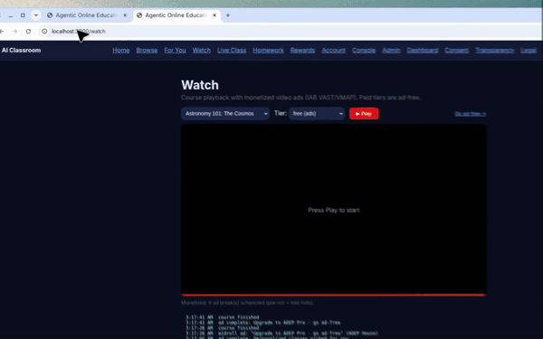 | 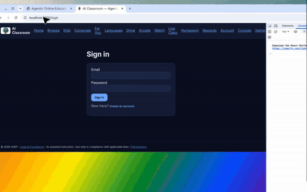 | 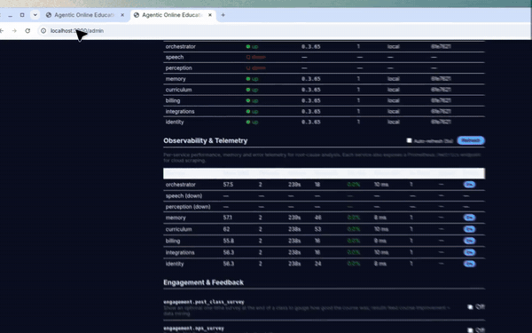 |  |
| Language learning | Careers / JD parsing | Kids mode | Member rewards |
| 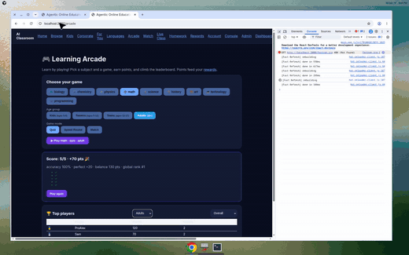 | 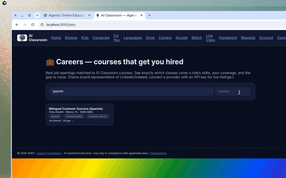 | 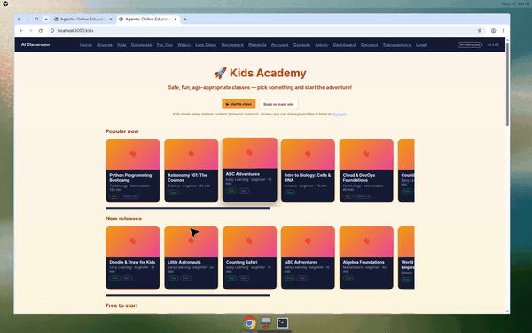 | 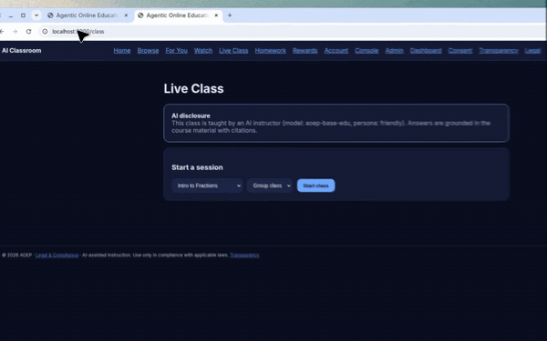 |

All recorded walkthroughs live in `docs/demos/` (animated `.gif` previews render
inline; matching `.mp4` files hold the full-quality recordings).

### Screenshots

| Signed-out landing | Profile dropdown | Live class answer | Themes |
| --- | --- | --- | --- |
| 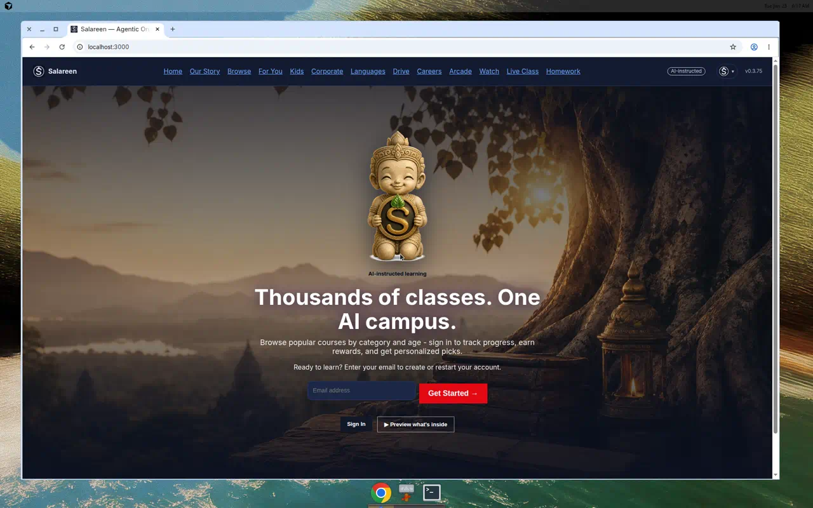 | 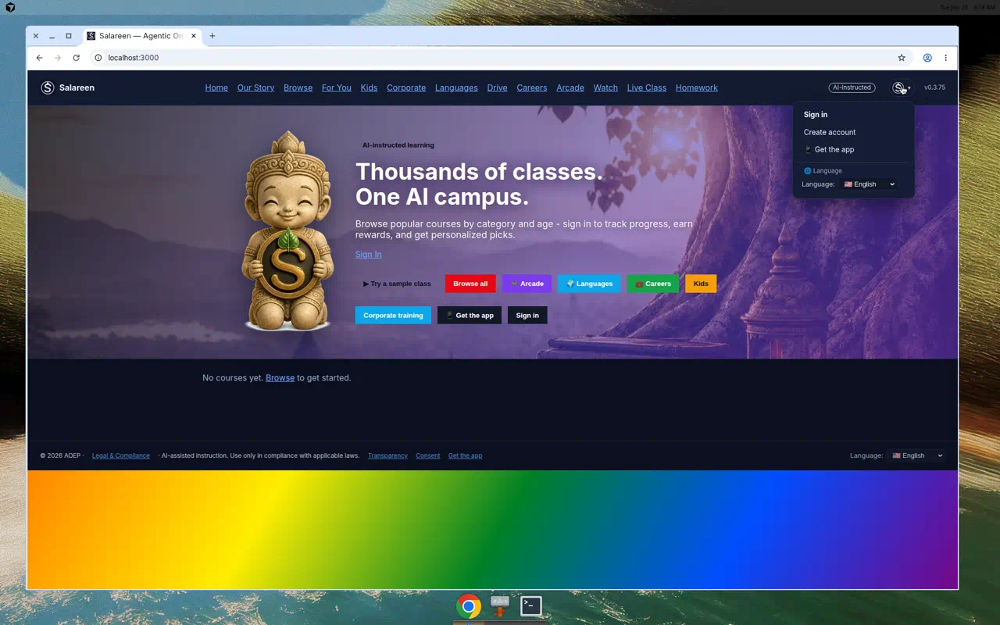 | 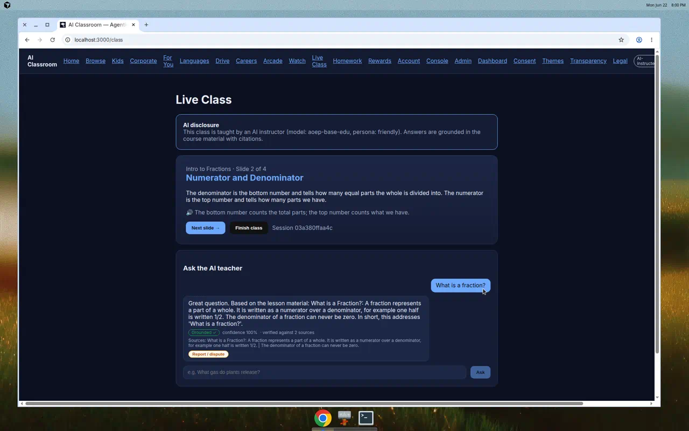 | 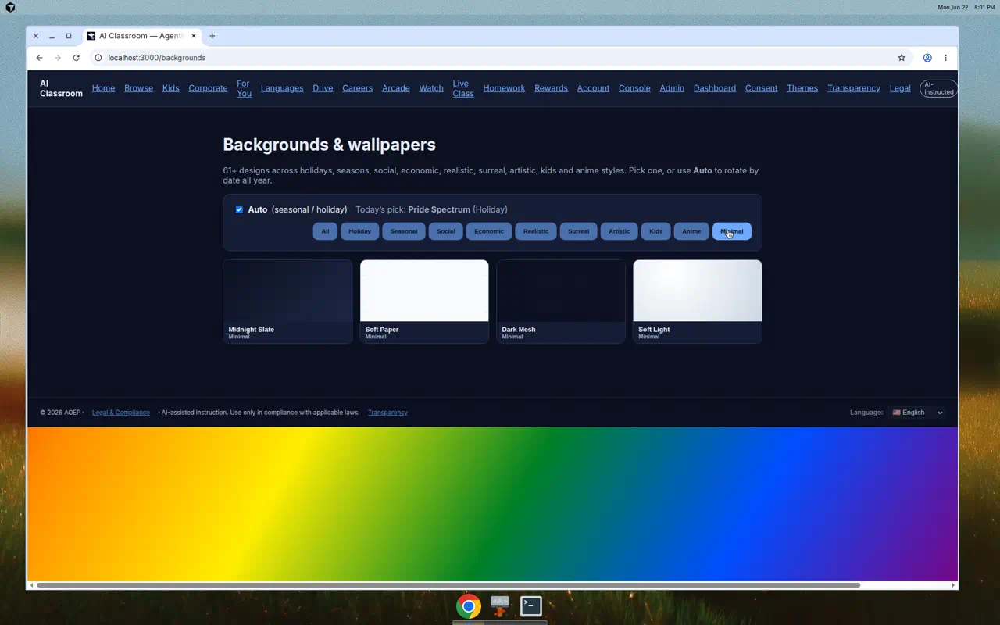 |

Additional screenshots live in `docs/screens/`.

> Per AGENTS.md, refresh these screenshots/videos whenever the UI changes.

## What is implemented

| Area | Status | Key surfaces |
| --- | --- | --- |
| Live class | Session start, slide advance, RAG Q&A, grounding, confidence, dispute reporting, HIL queue | `apps/web/app/class`, `services/orchestrator` |
| Curriculum | Catalog, search/facets, decks, scenes, RAG, validation, corrections, homework, audio courses | `services/curriculum` |
| Mobile | Expo app, Drive Mode (voice profiles, Hey Sala, driving detection), Netflix-style rails, My List, progress, notifications, i18n, EAS profiles | `apps/mobile` |
| Language learning | 27 supported language codes including Turkish and Khmer; rich/starter tiers; exercises/pronunciation hooks | `aoep_shared/language_learning.py`, `services/speech` |
| Careers | Job board, skill coverage, JD parsing, certification class matching | `/jobs`, curriculum jobs APIs |
| Accounts | Signup/login, session tokens, students, portfolio, profile context sharing, rewards | `services/identity` |
| Payments | 44 payment methods across 12 processors; sandbox/local and provider-routed cloud paths | `docs/payments.txt`, `services/billing` |
| Integrations | Signed webhooks, LMS/LTI/OneRoster/AGS, finance webhooks, cloud notify/calendar/SSO, API clients | `services/integrations` |
| Ops | `/version`, `/__meta`, telemetry, metrics, flags, testsupport, rate limits, ETags, load tests | shared service middleware + `qa/` |
| Compliance | Legal notices, disclaimer gate, privacy/DPA, consent, retention, regional policy, internal auth gates | `legal/`, `services/memory` |
| Scale/hosting | Docker compose, k8s manifests, HPAs/PDBs/Ingress/Redis, Terraform skeletons, hosting plan | `infra/`, `docs/hosting.txt`, `docs/scalability.txt` |
| Vultr VKE | Provider overlay for Vultr Container Registry, VKE ingress hosts, Vultr Object Storage, and VKE block-storage constraints | `infra/k8s-vke` |

Known live-class gap: the current web example is interactive but not yet fully
autonomous per-student live orchestration. The Director, TeachingBrain, Memory
signals, HIL, and adaptive policy exist; the next implementation step is wiring
those into a tick-by-tick live agent loop that changes pacing, reteaches, quizzes,
and feedback per student during the same course.

## Architecture

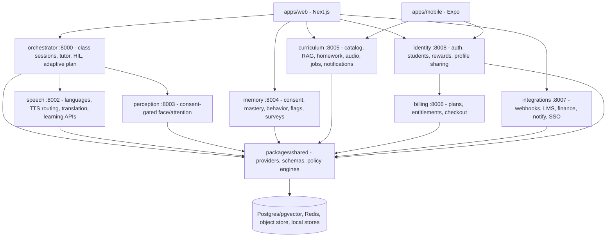

The `:800x` ports above are the **local-dev** ports (docker compose / `uvicorn`). In
the Kubernetes cluster every service listens on **`:8000`** and is reached by its
Service name (e.g. `http://curriculum:8000`); the browser reaches them through the
Ingress (see below).

### Kubernetes deployment (Vultr VKE)

Manifests: `infra/k8s` (base, kustomize) + `infra/k8s-vke` (Vultr overlay: image
registry rewrite, `salareen.com` hosts, cert-manager TLS, object storage). Images
are built and rolled by `.github/workflows/deploy.yml`.

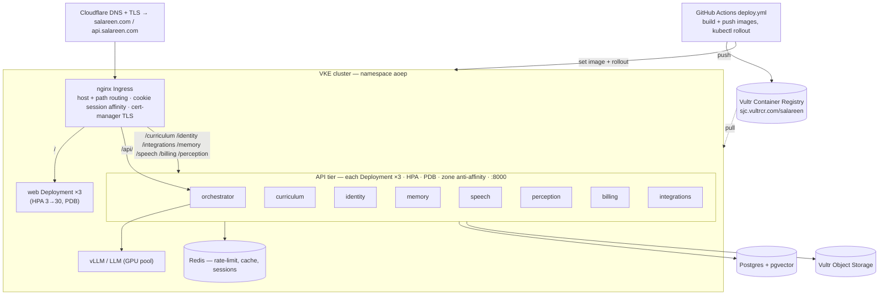

### Live-class request flow (in cluster)

The orchestrator keeps class sessions in-memory, so the Ingress uses a **cookie
session affinity** to pin each learner to the replica that created their session
(otherwise `…/advance|ask` would round-robin to a pod that never saw the session
and 404). A Redis-backed session store is the durable follow-up.

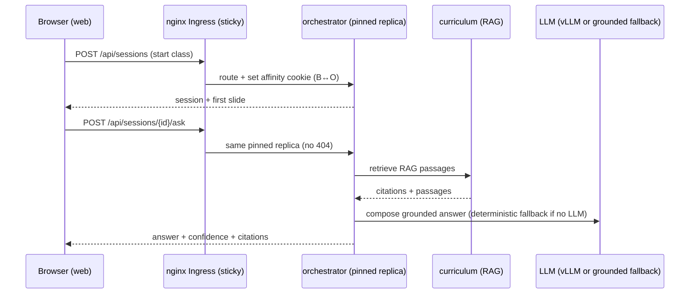

## Repository layout

| Path | Purpose |
| --- | --- |
| `apps/web` | Next.js web app and admin/user surfaces |
| `apps/mobile` | Expo React Native mobile app |
| `apps/agent-runtime` | LiveKit agent runtime and edge packaging |
| `packages/shared` | Provider interfaces, settings, schemas, adaptive/assessment/compliance engines |
| `services/orchestrator` | Teaching Director, sessions, Tutor Q&A, HIL, assessment |
| `services/curriculum` | Catalog, RAG, decks, jobs, homework, audio courses, notifications |
| `services/identity` | Auth, students, rewards, profile sharing |
| `services/memory` | Consent, mastery, behavior signals, flags, surveys, telemetry state |
| `services/integrations` | Webhooks, LMS, finance, cloud connectors, API clients |
| `services/billing` | Plans, entitlements, payment methods, checkout |
| `services/speech` | Language coverage, TTS routing, translation, learning APIs |
| `services/perception` | Face recognition and attention/engagement |
| `infra/compose` | Local Docker compose stack and scaling overlay |
| `infra/k8s` | Kubernetes base manifests (kustomize): Deployments/Services, HPA/PDB, Ingress (+ per-service API routes), Redis, configmap |
| `infra/k8s-vke` | Vultr VKE overlay: registry rewrite, salareen.com hosts, cert-manager TLS, object storage, runbook |
| `.github/workflows` | CI (tests/lint), QA, and `deploy.yml` (build+push images → roll the cluster) |
| `infra/terraform` | AWS and Cloudflare skeletons |
| `db/migrations` | SQL schema-of-record |
| `docs` | Architecture, brand, hosting, scalability, payments, screenshots, demos |
| `legal` | Terms, privacy, DPA, disclaimer, acceptable use, sweepstakes |

## Setup

Backend:

```bash
python3 -m venv .venv
. .venv/bin/activate
python3 -m pip install --upgrade pip
python3 -m pip install -r requirements-dev.txt
make install
```

Web:

```bash
cd apps/web
pnpm install
pnpm run typecheck
pnpm run build
```

Mobile:

```bash
cd apps/mobile
pnpm install
pnpm run typecheck
pnpm run export
```

Android native build prerequisites:

```bash
export ANDROID_HOME=/usr/lib/android-sdk
export ANDROID_SDK_ROOT=/usr/lib/android-sdk
export PATH=$ANDROID_HOME/platform-tools:$ANDROID_HOME/build-tools/34.0.0:$ANDROID_HOME/cmdline-tools/13.0/bin:$PATH
cd apps/mobile
pnpm run native:prebuild:android
pnpm run native:build:android
```

`native:build:android` still requires network access to Maven/Gradle plugin
repositories for Kotlin and Android Gradle plugin artifacts.

## Run commands

Core local teaching loop:

```bash
# Terminal 1 - orchestrator, live class API
cd services/orchestrator
DEPLOY_MODE=local CURRICULUM_DIR=/workspace/sample-curriculum \
  PYTHONPATH=src uvicorn orchestrator.main:app --port 8000

# Terminal 2 - curriculum, catalog/audio/jobs/home APIs
cd services/curriculum
DEPLOY_MODE=local PYTHONPATH=src uvicorn curriculum.main:app --port 8005

# Terminal 3 - web app
cd apps/web
pnpm run dev
```

Then open `http://localhost:3000`, `http://localhost:3000/class`,
`http://localhost:3000/drive`, `http://localhost:3000/jobs`, or
`http://localhost:3000/backgrounds`.

Full compose stack:

```bash
docker compose -f infra/compose/docker-compose.yml config
docker compose -f infra/compose/docker-compose.yml up --build
```

Vultr Kubernetes Engine:

```bash
kustomize build infra/k8s-vke
kubectl apply -k infra/k8s-vke
```

See `infra/k8s-vke/RUNBOOK.txt` for VKE cluster creation, ingress-nginx,
cert-manager, DNS, secrets, image push, and verification steps.

Multi-replica local overlay:

```bash
make scale-up
make loadtest URL=http://localhost:18500/audio/categories RPS=500 DURATION=30
make scale-down
```

Mobile (static export preview of the JS bundle; for the live app use
`pnpm start` — see "Set up, run, and build the mobile app" under Mobile platform):

```bash
cd apps/mobile
pnpm run export
cd dist
python3 -m http.server 3001
```

## Tests, regressions, and QA

| Check | Command |
| --- | --- |
| All backend tests | `make test` |
| Python lint | `make lint` |
| Coverage | `make coverage` |
| Web typecheck | `make web-typecheck` |
| Web build | `make web-build` |
| Mobile install | `make mobile-install` |
| Mobile typecheck | `make mobile-typecheck` |
| Mobile export build | `make mobile-build` |
| Compose config | `make compose-config` |
| Regression gate | `make qa` |
| API stress | `make stress` |
| Sustained load test | `make loadtest URL=http://localhost:8005/audio/categories RPS=200 DURATION=15` |

Focused tests added by recent branches cover catalog i18n, homework i18n, Khmer
support, notifications, payments, rate limiting, HTTP cache/ETag behavior,
service scaling, internal-auth gates, profile context sharing, and mobile builds.

## API map

For the full, route-by-route reference (every endpoint, auth tier, webhooks,
use cases, and cost analysis) see:

- `docs/api-reference.txt` — every HTTP API + webhook, conventions, auth tiers
  (kept in sync by `scripts/check_api_docs.py`; the per-service `/openapi.json`
  is the machine-readable source of truth).
- `docs/api-use-cases.txt` — end-to-end recipes (curl) for real flows.
- `docs/api-cost-value.txt` — cost-to-value analysis per API/provider.
- `docs/integrations-jobs-careers.txt` — how Careers connects to job sites.
- `docs/payments-and-security.txt` — how transactions connect and are secured.

| Service | Important endpoints |
| --- | --- |
| orchestrator | `GET /api/lessons`, `POST /api/sessions`, `POST /api/sessions/{id}/advance`, `POST /api/sessions/{id}/ask`, `/director/plan`, `/assessment/quiz`, `/api/hil/*` |
| curriculum | `/courses/search`, `/home`, `/audio/courses`, `/jobs`, `/jobs/parse`, `/recommend`, `/homework/*`, `/catalog/export`, `/notifications/feed`, `/validate/*`, `/scenes/*` |
| identity | `/auth/signup`, `/auth/login`, `/students`, `/profile-shares/context`, `/portfolio`, `/rewards`, `/games/*`, `/language/practice` |
| memory | `/consent`, `/legal/notices`, `/legal/accept`, `/compliance/{region}`, `/retention/purge`, `/flags/*`, `/survey/*`, `/mastery`, `/behavior`, `/learner/{student}/{topic}` |
| integrations | `/webhooks/subscriptions`, `/webhooks/emit`, `/webhooks/inbound/{provider}`, `/payments/webhook/{provider}`, `/lms/*`, `/notify`, `/calendar/schedule`, `/sso/oidc`, `/clients` |
| billing | `/plans`, `/payment-methods`, `/payment-methods/by-country`, `/entitlements/can-start`, `/checkout` |
| speech | `/languages`, `/tts/engine`, `/delivery/plan`, `/translate`, `/learn/*` |
| perception | `/enroll/{student_id}`, `/identify`, `/analyze/consent-check`, `/gallery` |

Every service created through `create_service()` also exposes `/health`,
`/version`, `/__meta`, `/metrics`, `/telemetry/summary`, `/telemetry/errors`,
and `/telemetry/logs`.

## Webhooks and third-party connections

`services/integrations` is the hub for outbound/inbound connectivity:

- Signed outbound webhooks with subscription storage and emit/retry plumbing.
- Inbound provider webhooks at `/webhooks/inbound/{provider}`.
- Payment webhooks at `/payments/webhook/{provider}`.
- LMS/LTI launch, roster sync, and grade passback.
- Finance payout and entitlement hooks.
- Cloud notification, calendar scheduling, OIDC/SSO endpoints.
- API client registry gated by internal auth.

Third-party/provider paths are environment-driven: Stripe/sandbox, PayPal,
Square, Razorpay, Paytm, Mercado Pago, VNPay, MoMo, ZaloPay, ABA/Wing/KHQR,
LTI/OneRoster/AGS, Slack/Workspace-style notify, calendar, OIDC/SAML, LiveKit,
S3/MinIO, Redis, Postgres/pgvector, vLLM/Ollama, Whisper/NLLB/XTTS, YuNet/SFace,
and OCR providers.

## Configuration

Configuration lives in `config/local.env` and `config/cloud.env`.

- `DEPLOY_MODE=local|cloud|edge` chooses provider defaults.
- Blank per-component overrides inherit `DEPLOY_MODE`.
- Component overrides include `LLM_MODE`, `SPEECH_MODE`, `VISION_MODE`,
  `MEDIA_MODE`, `OBJECT_STORE_MODE`, `PAYMENT_MODE`, `OCR_MODE`, and related
  URLs/secrets.
- Internal/admin controls use `ADMIN_SECRET`, `INTERNAL_TOKEN`,
  `INTERNAL_TOKEN_KEY`, and service-specific webhook/payment keys.

## Security, restrictions, and regulatory information

License: proprietary. See `LICENSE`. Use is limited to authorized educational
purposes and must comply with applicable laws, institution policies, and product
notices.

Legal and policy files:

| File | Purpose |
| --- | --- |
| `legal/TERMS.txt` | Terms of use and AI-specific terms |
| `legal/PRIVACY.txt` | Privacy notice for student/personal data |
| `legal/DPA.txt` | Data Processing Addendum |
| `legal/DISCLAIMER.txt` | Required AI/disclaimer notice |
| `legal/ACCEPTABLE_USE.txt` | Prohibited and restricted usage |
| `legal/SWEEPSTAKES.txt` | Rewards/prize rules |
| `SECURITY.txt` | Vulnerability disclosure and notification policy |
| `NOTICE.txt` | Third-party and open-weight/OER notices |

Compliance controls in code:

- AI disclosure endpoint and one-time disclaimer gate.
- Consent-gated biometric features and name-only fallback.
- Region policy via `aoep_shared.compliance`.
- Retention purge endpoint and scheduled purge script.
- Internal-auth gates on sensitive admin, correction, export, provenance, HIL,
  optimization, retention, enrollment, webhook/client, and payout endpoints.
- Webhook signing fails closed in cloud mode when required signing keys are unset.
- Profile sharing uses explicit owner grants, scopes, expiry, and bearer tokens.
- Rate limiting, ETags, telemetry, request IDs, and Prometheus metrics.

These legal files are engineering templates and must be reviewed by qualified
counsel before public/commercial release.

## Mobile platform

The Expo app supports Android and iOS with:

- Drive Mode audio classes using `expo-speech`, with **narration voice profiles**
  (child-friendly, accessible/slower, calm, clear, or Auto from learning profile).
- **Hey Sala** hands-free Q&A in Drive Mode via native speech recognition
  (Siri on iOS, Google on Android; requires a dev/native build).
- **Opt-in driving detection** (GPS speed + motion sensors) with alerts and
  optional auto-launch into Drive Mode.
- **Learning profile survey** shown once after login; persisted to identity.
- Netflix-style home rails and category cards.
- Continue Listening, My List, local progress, streaks, and saved settings.
- Local notifications and alerts inbox.
- Locale picker with 13 translated UI locales plus supported-language fallback.
- EAS build profiles for development, preview APK, and production app bundle/IPA.

### Mobile app on macOS — setup, run, and debug

Salareen mobile is an **Expo SDK 51** app in `apps/mobile`. On a Mac you can run it
in the **iOS Simulator** and/or an **Android emulator**.

> **Developer note:** Many teams find **native dev builds** (`pnpm run ios` /
> `pnpm run android`) more reliable than **Expo Go** (no separate Expo Go install,
> correct launcher icon, closer to production). Expo Go is still documented below
> for quick JS-only iteration. Full operational detail: **`apps/mobile/RUN.txt`**.

#### Requirements (install once)

| Requirement | Version / notes |
| --- | --- |
| macOS | Apple Silicon or Intel |
| **Xcode** | From the App Store; open once after install |
| **iOS Simulator runtime** | Xcode → **Settings → Platforms** → install the latest **iOS Simulator** (after every major Xcode update). If simulators fail to boot, **reboot the Mac** once. |
| **Node.js** | 18+ (22.x is common on Mac; repo sets 12 GB heap for Metro) |
| **pnpm** | `npm i -g pnpm` — repo standard (`apps/mobile/.npmrc` needs hoisted `node_modules`) |
| **CocoaPods** | `sudo gem install cocoapods` (iOS native builds) |
| **Android Studio** | Optional; only for Android emulator / `pnpm run android` |
| **ANDROID_HOME** | Add to `~/.zshrc`: `export ANDROID_HOME=$HOME/Library/Android/sdk` and `export PATH=$ANDROID_HOME/emulator:$ANDROID_HOME/platform-tools:$PATH` |

Verify toolchain (always start with verbose doctor):

```bash
cd apps/mobile
pnpm run setup                    # one-time wizard: deps + doctor + Expo Go (Path A)
# or if you skip Expo Go:
bash scripts/mobile-install.sh
VERBOSE=1 bash scripts/mobile-doctor.sh
```

#### Choose a dev path

| Path | Best for | Daily command (verbose) | First-run time |
| --- | --- | --- | --- |
| **B — Native dev build** *(recommended)* | Reliable Mac setup; real app icon; notifications | `pnpm run ios:debug` / `pnpm run android:debug` | **10–20 min** (prebuild + CocoaPods/Gradle) |
| **A — Expo Go** | Fastest JS hot-reload only; no native compile | `pnpm run launch:ios:debug` / `pnpm run launch:android:debug` | 5 min + **one-time Expo Go install** on each simulator |

`npm run ios` and `npm run android` work the same as `pnpm run ios` / `pnpm run android`
when run from `apps/mobile`. **Do not** run bare `expo` or `pnpm exec expo` on Mac
(Node heap OOM); all scripts go through `scripts/mobile-expo.sh`.

---

#### Path B — Native dev build (recommended on Mac)

**One-time** (generates `ios/` and `android/`, installs pods / Gradle deps):

```bash
cd apps/mobile
bash scripts/mobile-install.sh
VERBOSE=1 bash scripts/mobile-doctor.sh
open -a Simulator                              # boot iOS Simulator manually
pnpm run ios:debug                             # first run: prebuild + pod install + compile
```

**Android** (boot an AVD in Android Studio first, or let the launch script boot one):

```bash
cd apps/mobile
pnpm run android:debug
```

**Daily dev** (after `ios/` / `android/` exist):

```bash
cd apps/mobile
pnpm run ios:debug          # iOS Simulator
pnpm run android:debug      # Android emulator
```

Start the curriculum API in another terminal (browse/home need it):

```bash
cd services/curriculum && DEPLOY_MODE=local PYTHONPATH=src \
  uvicorn curriculum.main:app --port 8005
```

---

#### Path A — Expo Go (optional; higher setup friction)

Expo Go is a **separate app** that must be installed on each simulator once.

```bash
cd apps/mobile
pnpm run setup                # installs deps + Expo Go on iOS Simulator
pnpm run launch:ios:debug     # Metro + opens project in Expo Go
pnpm run launch:android:debug # boot AVD + Metro + Expo Go
```

If Expo Go is missing: `bash scripts/mobile-install-expo-go-ios.sh` (network once).
Manual: https://expo.dev/go?platform=ios&sdkVersion=51

Expo Orbit is **optional** (desktop helper) — not required.

---

#### macOS — iOS Simulator checklist

1. Install / update **Xcode** from the App Store.
2. Accept license: `sudo xcodebuild -license accept`
3. Install simulator runtime: **Xcode → Settings → Platforms → iOS Simulator** (pick the latest, e.g. iOS 18.x for current Xcode).
4. If simulators hang after an Xcode update: **reboot the Mac**, then:
   ```bash
   xcode-select -p
   xcrun simctl list devices available | head
   open -a Simulator
   ```
5. List simulator UDIDs (for `xcodebuild`):
   ```bash
   xcrun simctl list devices available | grep iPhone
   ```

---

#### macOS — Android emulator checklist

1. Install **Android Studio** → **Device Manager** → **Create Virtual Device** (e.g. Pixel 7, API 34+).
2. Add to `~/.zshrc` and `source ~/.zshrc`:
   ```bash
   export ANDROID_HOME=$HOME/Library/Android/sdk
   export ANDROID_SDK_ROOT=$ANDROID_HOME
   export PATH=$ANDROID_HOME/emulator:$ANDROID_HOME/platform-tools:$PATH
   ```
3. Boot the AVD (Android Studio ▶ or `emulator -avd <name> &`).
4. Confirm: `adb devices` shows an `emulator-*` device.

---

#### Debugging when something fails

Always use **verbose** commands first.

| Step | Command |
| --- | --- |
| 1. Environment check | `VERBOSE=1 bash scripts/mobile-doctor.sh` |
| 2. Kill stale Metro | `bash scripts/mobile-metro-cleanup.sh` |
| 3. Reinstall deps | `bash scripts/mobile-install.sh` |
| 4. iOS native (Expo) | `pnpm run ios:debug` |
| 5. Android native (Expo) | `pnpm run android:debug` |
| 6. iOS **xcodebuild** directly | `pnpm run xcode:debug` (after `ios/` exists) |
| 7. Android **Gradle** directly | `pnpm run gradle:debug` (after `android/` exists) |
| 8. Typecheck | `VERBOSE=1 bash scripts/mobile-typecheck.sh` |

**iOS — `xcodebuild` directly** (when `pnpm run ios:debug` fails opaquely):

```bash
cd apps/mobile
pnpm run prebuild                    # if ios/ missing
SIM_UDID=<your-simulator-udid> pnpm run xcode:debug
```

Example (replace UDID with yours from `xcrun simctl list`):

```bash
/Applications/Xcode.app/Contents/Developer/usr/bin/xcodebuild \
  -workspace ios/Salareen.xcworkspace \
  -configuration Debug \
  -scheme Salareen \
  -destination id=A701BBF9-D0E2-41D9-AD2B-3E7E1461E8C9 \
  build
```

**Android — Gradle verbose** (after prebuild):

```bash
cd apps/mobile/android
./gradlew assembleDebug --info --stacktrace
```

**Common failures**

| Symptom | Fix |
| --- | --- |
| JavaScript heap OOM (~4040 MB) | Use bash scripts / `pnpm run launch:*:debug` — never raw `expo` |
| `pnpm install` says up-to-date but `node_modules` empty | `bash scripts/mobile-install.sh` |
| Simulator won't boot after Xcode update | Install Platforms runtime; reboot Mac |
| Stuck at "Fetching bundled native modules" | `bash scripts/mobile-metro-cleanup.sh` then `bash scripts/mobile-install-expo-go-ios.sh` |
| "Expo Go is not installed" | `pnpm run setup` or `bash scripts/mobile-install-expo-go-ios.sh` |
| Empty browse/home rails | Start curriculum on port 8005 (see below) |
| Wrong directory | All commands from **`apps/mobile`**, not repo root |

---

#### Backend URL (simulator vs device)

`app.json` → `expo.extra.curriculumUrl` (default `http://localhost:8005`).

- **iOS Simulator:** `localhost` is your Mac — works as-is.
- **Android emulator:** app uses `10.0.2.2` automatically (`src/config.ts`).
- **Physical device:** use your Mac's LAN IP, not `localhost`.

```bash
cd services/curriculum && DEPLOY_MODE=local PYTHONPATH=src \
  uvicorn curriculum.main:app --port 8005
```

---

#### Build, typecheck, and release

```bash
cd apps/mobile
pnpm run typecheck:verbose
pnpm run export:verbose              # JS bundles → apps/mobile/dist/
pnpm run eas:build:preview:android   # cloud APK (needs eas-cli + Expo account)
```

Makefile shortcuts from repo root: `make mobile-setup`, `make mobile-doctor-verbose`,
`make mobile-launch-ios-debug`, `make mobile-build`.

Offline native projects: `pnpm run prebuild` then `pnpm run native:build:android`.
EAS profiles: `apps/mobile/eas.json`. Deeper troubleshooting: **`apps/mobile/RUN.txt`**.

## Hosting and scale

- `docs/hosting.txt` recommends AWS for compute/state/GPU and Cloudflare for DNS,
  CDN, WAF, DDoS, and edge storage.
- `docs/scalability.txt` documents rate limiting, ETags/cache, multi-replica
  compose, k8s HPA/PDB/anti-affinity/Ingress/Redis, load testing, and capacity
  math.
- `infra/k8s-vke/` contains the Vultr Kubernetes Engine overlay and runbook.
- `infra/terraform/` contains AWS and Cloudflare skeletons.
- `infra/k8s/` contains service, autoscaling, ingress, Redis, and kustomize files.

## Project conventions

- Use `python3`, never `python`.
- Keep local/cloud/edge behavior selected by env, not code forks.
- Pin dependency versions.
- Keep model weights and generated build outputs out of the repo.
- Update `CHANGELOG.txt` for meaningful changes.
- Do not add new markdown files unless explicitly requested.
