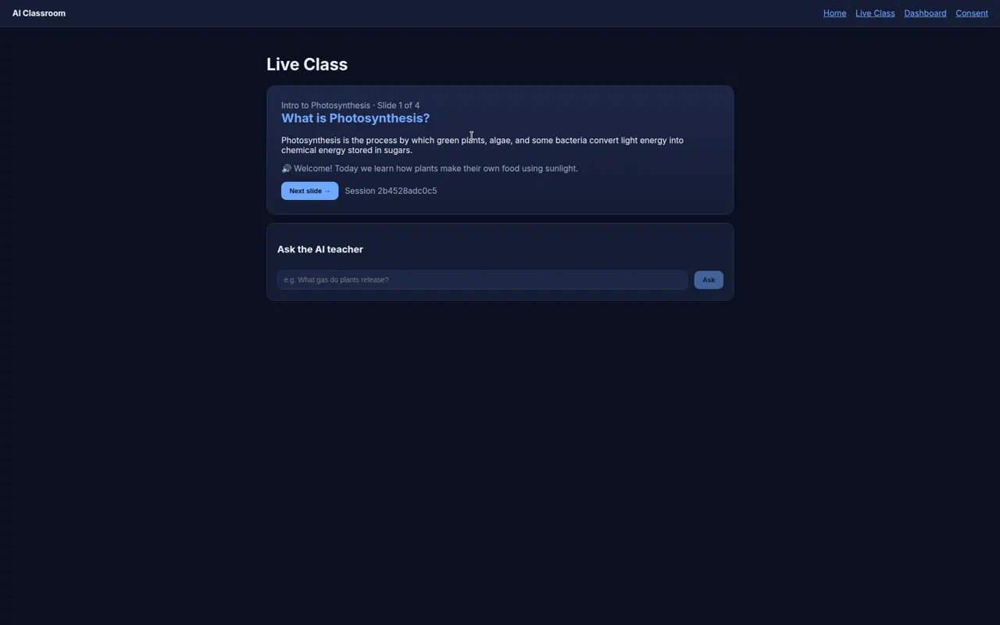
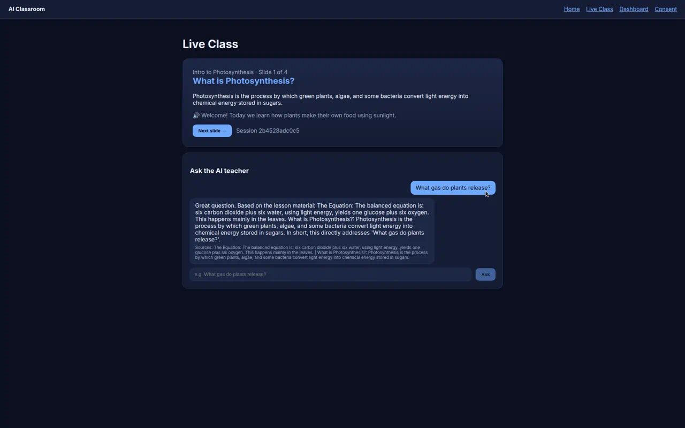
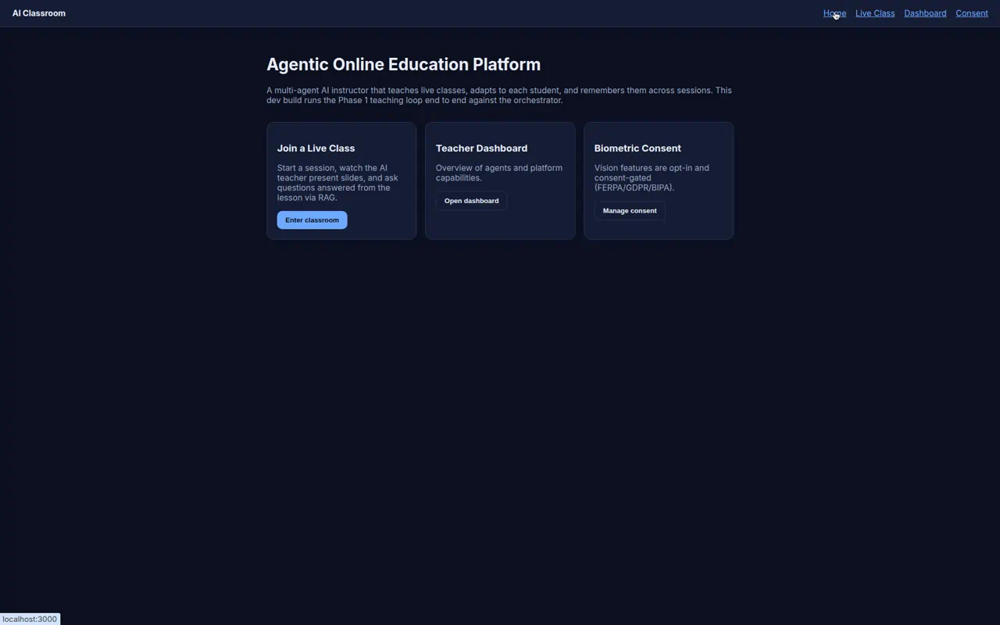
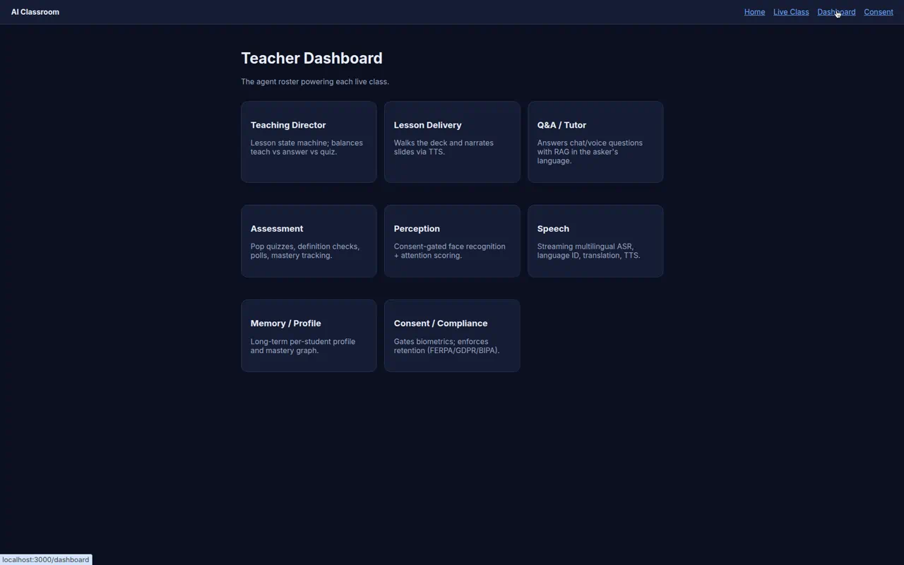
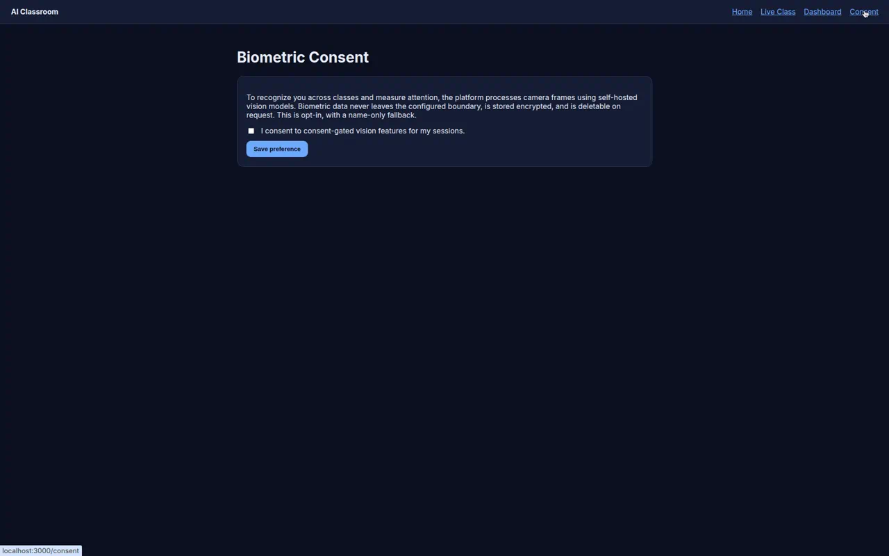

<p align="center">
  
</p>

<h1 align="center">AI Classroom &middot; Agentic Online Education Platform</h1>

<p align="center">
  A multi-agent AI instructor that teaches live online classes (group and 1:1),
  perceives the room over webcam, remembers every student across sessions, and
  adapts pedagogy in real time &mdash; built own-platform first, then bridged into
  Zoom / Teams / Meet.
</p>

<p align="center">
  
</p>

---

> **Project conventions:** plain-text/code only (no markdown beyond this README and
> `AGENTS.md`), always `python3`, dual-mode via env (no code forks), pinned
> dependency versions, and `CHANGELOG.txt` updated on every meaningful change.
> See `docs/plan.txt` and `docs/cloud-agent-task.txt` for the full spec.

## Table of contents

- [What is this?](#what-is-this)
- [Screenshots](#screenshots)
- [Build status by phase](#build-status-by-phase)
- [Architecture](#architecture)
- [Tech stack](#tech-stack)
- [Repository layout](#repository-layout)
- [Prerequisites](#prerequisites)
- [Quickstart](#quickstart)
- [Running the app](#running-the-app)
- [Testing &amp; linting](#testing--linting)
- [Configuration &amp; dual-mode](#configuration--dual-mode)
- [Full stack with Docker Compose](#full-stack-with-docker-compose)
- [The agents](#the-agents)
- [Compliance](#compliance)
- [Contributing](#contributing)

## What is this?

The platform pairs an **own agentic orchestration layer** with a base education
LLM (open-weight, RAG now, fine-tune later) on top of **LiveKit** (WebRTC) as the
real-time media backbone. The same codebase runs **fully local** (single
machine / docker compose) or **against a cloud backend**, switched purely by
configuration &mdash; there are no code forks. Every heavy capability (LLM, speech,
vision, media, object store, payments) sits behind a narrow interface with a
local and a cloud implementation, chosen at startup by a config-driven factory.

The current build runs the **live teaching loop end to end** in the web app
(start a class, the Teaching Director presents slides, ask the AI tutor questions
answered with RAG), plus working **face recognition**, **adaptive
pacing/difficulty**, **assessment** (quizzes/polls), a **curriculum CMS**,
**entitlements + multiple payment methods**, and **multilingual delivery
routing** &mdash; all testable offline. Real-time voice/video, GPU model serving,
and the external platform bridges (Zoom/Teams/Meet) are wired behind config and
need infra/credentials to run. See the status table below.

## Screenshots

| Live class &mdash; slide delivery | Live class &mdash; ask the AI teacher (RAG + citations) |
| --- | --- |
|  |  |

| Home | Teacher dashboard (agent roster) | Biometric consent |
| --- | --- | --- |
|  |  |  |

## Build status by phase

The roadmap (`docs/plan.txt`) spans phase0 &rarr; phase10. This is the honest
current state of the repository:

Legend: ✅ implemented &amp; tested · ◑ partial (offline logic done; needs GPU/media/external infra) · ⬜ scaffolded behind interfaces/config.

| Phase | Scope | Status |
| --- | --- | --- |
| **phase0** | Foundations: monorepo, provider abstraction (local+cloud + factory), config contracts, db migrations, sample-curriculum RAG skeleton, vLLM serving config, local docker compose, per-service Dockerfiles, Makefile, CI | ✅ Implemented |
| **phase1** | Live AI teacher in the web app: Director + Lesson Delivery + Tutor; slide presentation + (text) narration; text-chat Q&amp;A via RAG | ◑ Text teaching loop works end to end; real-time LiveKit audio / agent-runtime room wiring still needs media infra |
| **phase2** | Multilingual + voice: language coverage (26 langs), per-student delivery routing (translate? pair supported? native XTTS vs cloud-TTS fallback) | ◑ Routing/coverage logic implemented &amp; tested; real streaming ASR / NLLB / XTTS need GPU model serving |
| **phase3** | Perception (consent-gated): face recognition + attention | ✅ Real self-hosted face recognition (OpenCV YuNet + SFace), consent-gated, enroll/identify, extensively tested |
| **phase4** | Memory &amp; adaptive learning: profiles, mastery, learning-behavior signals, pacing/difficulty policy (solo vs group) | ✅ Implemented &amp; tested (adaptive policy + behavior tracking) |
| **phase5** | Assessment: quizzes, definition checks, polls, mastery feedback loop | ✅ Implemented &amp; tested (MCQ generation, grading, polls) |
| **phase6** | Curriculum suite / CMS: author/import/manage decks | ✅ Implemented &amp; tested (deck CRUD + text import + presentation view) |
| **phase6b** | Monetization &amp; billing: entitlements API + payment methods (card, Apple/Google Pay, Cash App, PayPal, Venmo, Zelle); Stripe (cloud) / sandbox (local) | ✅ Implemented &amp; tested (sandbox simulates all methods offline) |
| **phase7** | Zoom bridge &rarr; LiveKit | ⬜ Scaffolded: `MediaBridge` interface + capability registry + credential checks; needs Zoom SDK + creds |
| **phase8** | Teams bridge (.NET Graph Communications) | ⬜ Scaffolded; needs Azure/Graph creds + a .NET media bot |
| **phase9** | Google Meet / Chat bridge | ⬜ Scaffolded; needs Google Workspace creds |
| **phase10** | Hardening &amp; scale: latency, GPU batching/pooling, observability, fine-tuning | ◑ Latency budget + recorder implemented &amp; tested; GPU/autoscale/observability stack needs infra |

> **In short:** phases 0, 3, 4, 5, 6, and 6b are implemented and tested; phases 1,
> 2, and 10 have their offline logic done but need GPU/media infra for the
> remaining pieces; phases 7&ndash;9 (platform bridges) are scaffolded behind a
> stable interface and need external SDKs/credentials to run. The whole backend
> suite is green (257 tests). Cloud k8s manifests under `infra/k8s` ship from the
> phase0 foundations; real model serving and platform bots require credentials/GPU.

## Trust, homework, HIL, edge, and integrations (in progress)

A second initiative adding a trust/transparency layer, a homework subtool, human-in-the-loop collaboration, an edge/embodiment path, and external integrations. Legend: ✅ built &amp; merged (offline-tested).

| # | Phase | Status | PR |
| --- | --- | --- | --- |
| Trust 1 | AI disclosure: `aoep_shared/disclosure.py` + `GET /api/disclosure` + AI-instructed badge + `/transparency` page | ✅ | #44 |
| Trust 2 | Content credentials: `aoep_shared/provenance.py` (C2PA-style manifest, HMAC sign/verify) + `/provenance/sign`+`/verify` + public `/verify` page | ✅ | #45 |
| Trust 3 | User-facing citations + grounded/confidence chip + "verified against N sources" + unsupported-claim flags in class Q&A | ✅ | #46 |
| Trust 4 | Human-of-record on `Course` + `POST /report` dispute -> corrections review loop + web "Report / dispute" control | ✅ | #47 |
| Trust 5 | Opt-in `delivery_mode` (ai/human/hybrid) + `/catalog` filter + `training/model_card.py` + `GET /model-cards` + public `/model-cards` page | ✅ | #48 |

| Homework 6 | Homework generation: `aoep_shared/homework` (Assignment/Question) + `POST /homework/generate` from deck/course | ✅ | merged |
| Homework 7 | Scan/OCR (typed + handwritten): `OcrProvider` + `providers/ocr.py` + `factory.ocr()` + `homework/ingest.py` + `POST /homework/scan` | ✅ | #50 |
| Homework 8 | AI-vs-human authorship: `homework/authorship.py` (burstiness/lexical + handwriting signal) + `POST /homework/authorship` (probabilistic signal) | ✅ | #51 |
| Homework 9 | Autograder: `homework/grade.py` (objective + open-item corroboration vs catalog RAG + trusted domains like webmd/nih) + `POST /homework/grade` + public `/homework` page | ✅ | #52 |

| HIL 10 | Human-in-the-loop core: `aoep_shared/hil.py` (autonomy levels + ReviewQueue + escalation policy) | ✅ | #53 |
| HIL 11 | Co-teaching: orchestrator gates answers through the queue + `/api/hil/*` + web `/console` teacher review (`HIL_AUTONOMY`) | ✅ | #54 |

## Backend workstreams (validation, catalog, corrections, adaptivity, models, harvester)

Delivered phase-by-phase (each its own version release / PR). The
*Validation, Course Catalog, and Corrections Backend* plan grew into six
workstreams (23 phases); status below. Legend: ✅ built &amp; merged (offline-tested)
· ◑ code/config/runbook merged, heavy execution runs on a forked GPU/worker agent.

| # | Phase | Status | PR |
| --- | --- | --- | --- |
| 1.1 | `SearchProvider` + per-engine adapters (Bing/Google/Brave/Kagi/Baidu) + `factory.search_engines()` | ✅ | #19 |
| 1.2 | Validation engine (`validation.py`: extract/validate claims, cross-engine corroboration) | ✅ | #20 |
| 1.3 | Validation endpoints (`POST /validate/claim`, `POST /decks/{id}/validate`) | ✅ | #20 |
| 2.1 | Catalog model/store + `db/migrations/0003_catalog.sql` | ✅ | #21 |
| 2.2 | Catalog API + adaptive program plan (`/courses`, `/programs`, `/catalog`, `/programs/{id}/plan`) | ✅ | #22 |
| 3.1 | Corrections model + bulk parse (CSV/JSONL) + gold-example conversion | ✅ | #23 |
| 3.2 | Corrections review API (submit/bulk/list/approve/reject) | ✅ | #24 |
| 3.3 | Corrections apply (patch content / emit gold) + `training/export.py --corrections` back-prop | ✅ | #25 |
| 3.4 | Hallucination guard (`groundedness.py`) + Tutor abstain/ground + `/api/groundedness/check` | ✅ | #26 |
| 4.1 | Bayesian Knowledge Tracing + prerequisite `SkillGraph` (`knowledge.py`) | ✅ | #27 |
| 4.2 | Variational-inference Bayesian IRT ability model (`inference.py`) | ✅ | #28 |
| 4.3 | Thompson-sampling content bandit + BKT-driven mastery + model&rarr;policy wiring | ✅ | #29 |
| 4.4 | `OptimizationLedger` (per-stage accuracy, promote/revert) + `/api/optimization/*` | ✅ | #30 |
| 5.1 | Model bake-off / champion-challenger harness (`training/bakeoff.py`): per-category + fairness scoring, fairness gate, champion pointer (`training/champion.py`) + revert | ✅ | #31, #35 |
| 5.2 | `RoutedLLMProvider` multi-model routing + vLLM multi-LoRA serving config + per-domain adapter trainer + `routes.py` | ✅ | #31, #36 |
| 5.3 | Track A data pipeline code (clean/quality/MinHash-dedup/decontam/shard/tokenizer) + model-ladder configs | ✅ | #31, #37 |
| 5.3b | Track A.2 model sizing + 3D-parallelism validation + pretrain `--check` CPU smoke | ✅ | #38 |
| 5.3c | Track A.3 scaling-law fit + staged pretrain orchestration + runbook (full run on cluster) | ◑ | #39 |
| 5.3d | Track A.4 alignment: SFT/DPO builders + safety blocklist + fairness guardrail + config (run on cluster) | ◑ | #40 |
| 5.5 | P19 champion promotion: A-vs-B bake-off -> promote to served pointer + serving wiring + runbook | ✅ | #41 |
| 5.4 | Track B per-domain QLoRA adapter training (scripts/configs) | ✅ | #31, #36 |
| 6.1 | Harvest source spec + license gate (`harvest/sources.py`) | ✅ | #32 |
| 6.2 | Harvest dedup queue (`harvest/queue.py`) | ✅ | #32 |
| 6.3 | Harvest worker pipeline + stats (`harvest/worker.py`) | ✅ | #32 |
| 6.4 | Quality+license gate -> idempotent, batch-versioned catalog upsert + metrics (`harvest/pipeline.py`) | ✅ | #32, #42 |
| 6.5 | 24/7 at scale: checkpoint/resume loop + harvester service worker + compose/k8s + runbook | ✅ | #43 |

All ✅ rows run and are tested in this repo (full suite green &mdash; 292 tests). The ◑
rows (Track A.3/A.4 cluster pretraining/alignment) have their code/config/runbooks
merged; their compute-heavy execution runs on forked GPU agents once the secrets
in `docs/secrets.txt` are provided.

- Course validation - pluggable, key-gated `SearchProvider` (Bing/Google CSE/Brave/Kagi/Baidu + offline mock) to corroborate course content against the web. `factory.search_engines()` returns whichever engines have API keys configured. Endpoints: `POST /validate/claim` and `POST /decks/{id}/validate` (per-claim supported/unverified/contradicted + confidence + citations).

- Course catalog - persistent Programs -> Courses -> Modules (modules reference CMS decks/scenes) with dynamic-program adaptive rules (e.g. prerequisite mastery). `curriculum/catalog.py` (`CatalogStore`, JSON-persisted) + `db/migrations/0003_catalog.sql`. Endpoints: `/courses`, `/programs`, `GET /catalog`, and `POST /programs/{id}/plan` (mastery-gated course ordering with `next_course`).

- Corrections - standardized review/correction model (`aoep_shared/corrections.py`) for course content and the training model, with single + bulk (CSV/JSONL) entry and `correction_to_training_example` (gold, reward=+1) for back-propagation. Protected attributes are excluded from training context by design. Review API: `POST /corrections`, `POST /corrections/bulk`, `GET /corrections`, approve/reject, and `POST /corrections/{id}/apply` (patches deck/scene content or emits a gold training example; `training/export.py --corrections` merges those into training).

- Hallucination guard - `aoep_shared/groundedness.py` checks every answer's claims against its retrieved sources (groundedness + risk score); the Tutor abstains/grounds an ungrounded answer (never serves unsupported content) and reports `grounded`/`hallucination_risk`/`unsupported`. `POST /api/groundedness/check`; detected hallucinations route into the corrections back-prop loop.

- Adaptive learner modeling - Bayesian Knowledge Tracing + a prerequisite SkillGraph belief network (`aoep_shared/knowledge.py`), a variational-inference Bayesian IRT ability model (`aoep_shared/inference.py`), and a Thompson-sampling content bandit (`aoep_shared/bandit.py`). Memory mastery is BKT-driven and `adaptive.signals_from_models` feeds BKT/IRT signals into the pacing/difficulty policy. An `OptimizationLedger` (`aoep_shared/optimization.py`) tracks per-stage accuracy and promotes/reverts optimizer steps (endpoints under `/api/optimization/*`).
- 24/7 course harvester - `aoep_shared/harvest` (license gate + dedup queue + worker) ingests 100k+ permissively-licensed/OER materials on a separate worker agent; see `services/harvester/RUNBOOK.txt`. Two-track LLM training (open-weight multi-model + from-scratch) with a bake-off harness lives under `training/` (see `training/RUNBOOK.txt`).

## Architecture

```
                 Browser (apps/web, Next.js)
                          |
                          v
        Orchestrator API (services/orchestrator, FastAPI)
        Teaching Director: lessons, sessions, slides, RAG Q&A
                          |
              packages/shared  ProviderFactory
        (selects local vs cloud per capability, by env)
   ┌──────────┬──────────┬──────────┬──────────┬──────────┐
  LLM       Speech     Vision      Media   ObjectStore  Payment
 (vLLM/    (Whisper/  (InsightFace (LiveKit) (MinIO/S3) (Stripe/
  Ollama)   XTTS)      /MediaPipe)                        sandbox)

  Supporting services (FastAPI): memory · speech · perception ·
  curriculum · billing        Worker: apps/agent-runtime (LiveKit Agents)
  Data: Postgres + pgvector · Redis · object store
```

**Dual-mode** is the core idea: `DEPLOY_MODE=local|cloud` sets the default
implementation family, and each capability can be overridden independently (for
example, keep biometrics local even in cloud for compliance) without forking code.

## Tech stack

- **Frontend:** Next.js 14 + React 18 + TypeScript (LiveKit JS SDK to come).
- **Backend / agents:** Python, FastAPI, LiveKit Agents, LangGraph (Director).
- **LLM serving:** open-weight base model via vLLM; RAG now, fine-tune later.
- **Vision (implemented):** self-hosted OpenCV YuNet + SFace face recognition (CPU).
- **Speech (provider-wired):** Whisper large-v3 (ASR), NLLB-200 (translation),
  XTTS-v2 (TTS) behind the SpeechProvider; need GPU model serving to run.
- **Data:** Postgres (+pgvector), Redis, S3-compatible object storage (MinIO local).
- **Infra:** docker compose (local) / Kubernetes + GPU pool (cloud); GitHub Actions CI.

## Repository layout

```
apps/web                 Next.js app (live class, dashboards, consent)
apps/agent-runtime       Python LiveKit Agents worker (teaching brain)
services/orchestrator    Director + lesson/slide/RAG Q&A API (FastAPI)
services/memory          profiles, mastery, learning-behavior signals
services/speech          language coverage + delivery routing (ASR/MT/TTS behind provider)
services/perception      vision: face recognition + attention, consent-gated
services/curriculum      content/CMS API: deck authoring/import + RAG search
services/billing         plans, entitlements + payment methods (Stripe/sandbox)
packages/shared          provider interfaces + local/cloud impls + factory + schemas
config/                  per-mode env contracts (local.env, cloud.env)
db/migrations            SQL schema (consent/compliance + billing/entitlements)
models/serving           vLLM serving config (weights downloaded at runtime)
sample-curriculum/       sample lessons for the RAG skeleton
infra/compose            local docker compose (full stack)
docs/                    plan.txt, cloud-agent-task.txt, images
```

## Prerequisites

- **Python 3.11+** (the dev environment uses system Python 3.12; `.python-version`
  requests 3.11 &mdash; both work).
- **Node.js 20+** and **pnpm 10+** for the web app.
- **Docker** (optional) only for the full containerized stack.

## Quickstart

```bash
# 1. Backend: create the virtualenv and install dev deps (editable shared package)
make setup            # == python3 -m venv .venv && pip install -r requirements-dev.txt

# 2. Web: install dependencies
make setup-web        # == cd apps/web && pnpm install

# 3. Run the tests
make test             # all Python tests (shared + services + agent-runtime)
make test-web         # web typecheck + lint
```

> On a fresh Debian/Ubuntu machine you may first need the venv package:
> `sudo apt-get install -y python3.12-venv`.

## Running the app

Run the two dev processes in separate terminals (start the orchestrator first):

```bash
# Terminal 1 - Orchestrator API (http://localhost:8000)
. .venv/bin/activate
export DEPLOY_MODE=local CURRICULUM_DIR="$PWD/sample-curriculum"
cd services/orchestrator && uvicorn app.main:app --reload --port 8000
#   or: make dev-orchestrator

# Terminal 2 - Web app (http://localhost:3000)
make dev-web          # == cd apps/web && pnpm run dev
```

Then open **http://localhost:3000/class**, start the "Intro to Photosynthesis"
lesson, advance slides, and ask the AI teacher a question. The web app reads the
backend URL from `NEXT_PUBLIC_ORCHESTRATOR_URL` (default `http://localhost:8000`).

Quick API check:

```bash
curl http://localhost:8000/health
curl http://localhost:8000/api/lessons
```

## Testing &amp; linting

| Target | Command |
| --- | --- |
| All Python tests | `make test` |
| Single package/service | `cd <path> && python -m pytest -q` |
| Web typecheck + lint | `make test-web` |
| Web production build | `make build-web` |
| Validate compose | `make compose-config` (requires Docker) |

The full backend suite (257 tests) is green: provider local-vs-cloud selection,
the orchestrator teaching flow (start &rarr; advance &rarr; ask) plus adaptive/assessment
APIs, real face-recognition accuracy on a labeled dataset, CMS deck CRUD/import,
multilingual delivery routing, payment methods, and bridge/latency scaffolds.

## Configuration &amp; dual-mode

Configuration lives in `config/local.env` and `config/cloud.env`:

- `DEPLOY_MODE=local|cloud` selects the default implementation family.
- Per-component overrides (`LLM_MODE`, `SPEECH_MODE`, `VISION_MODE`,
  `MEDIA_MODE`, `OBJECT_STORE_MODE`, `PAYMENT_MODE`) override a single capability;
  **blank means "inherit `DEPLOY_MODE`"**.
- Endpoints/connection strings (`LLM_BASE_URL`, `LIVEKIT_URL`, `DATABASE_URL`,
  `REDIS_URL`, `OBJECT_STORE_ENDPOINT`, ...) are read by the cloud impls.

In **local** mode the heavy providers are deterministic, dependency-free stubs so
the teaching loop runs offline (no GPU/keys). In **cloud** mode they target
managed/GPU backends and raise `CloudProviderUnavailable` until real endpoints
and credentials are wired.

## Full stack with Docker Compose

`infra/compose/docker-compose.yml` defines the full local stack: `web`,
`orchestrator`, the supporting services, `agent-runtime`, `livekit`,
`postgres` (pgvector), `redis`, and `minio`.

```bash
docker compose -f infra/compose/docker-compose.yml config   # validate
docker compose -f infra/compose/docker-compose.yml up --build
```

## The agents

| Agent | Responsibility |
| --- | --- |
| Teaching Director | Lesson state machine; balances teach vs answer vs quiz vs re-engage |
| Lesson Delivery | Walks the deck, narrates slides via TTS, plays videos |
| Q&amp;A / Tutor | Chat + voice questions, RAG over curriculum, answers in the asker's language |
| Assessment | Pop quizzes, definition/key-point checks, polls, mastery |
| Perception | Consent-gated face recognition + attention/gaze scoring |
| Speech | Streaming multilingual ASR, language ID, translation, TTS |
| Memory / Profile | Long-term per-student profile, mastery graph, cross-class history |
| Consent / Compliance | Gates biometric features; enforces retention/deletion (FERPA/GDPR/BIPA) |

## Compliance

Biometric features are **opt-in** and consent-gated, with a name-only fallback.
Face embeddings are stored encrypted, deletable on request, and never leave the
configured boundary. Recording and data-retention disclosures are surfaced in the
app (and, later, in bridged meetings).

## Contributing

- Do **not** add new markdown files (this `README.md` and `AGENTS.md` aside) &mdash;
  use code, comments, and plain-text `.txt`.
- Always use `python3` (never `python`).
- Keep the dual-mode contract: no code forks; switch behavior via env only.
- Pin dependency versions; keep large model weights out of the repo.
- Update `CHANGELOG.txt` with every meaningful change.
- See `AGENTS.md` for environment/run caveats for automated agents.
