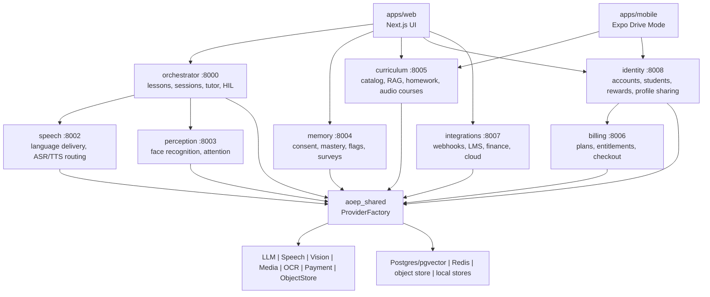
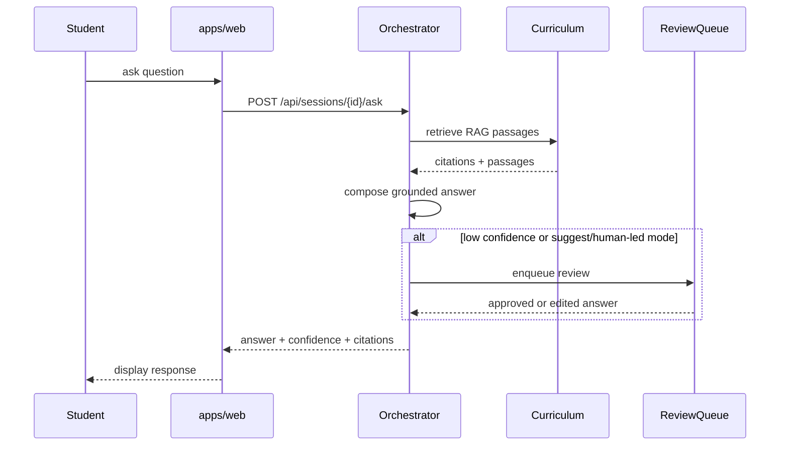
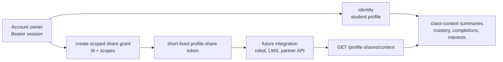

# AI Classroom - Agentic Online Education Platform

AI Classroom is a multi-service education platform for live AI-taught classes,
audio-only Drive Mode lessons, adaptive learning, rewards, compliance controls,
and future integrations with LMS, finance, cloud collaboration, and external
classroom technology.

The repository is intentionally text-first. The old README referenced logo,
screenshot, demo, and chart files that are not currently checked in, so this
README does not embed those broken assets. Brand notes remain in
`docs/brand/branding.txt`; add real logo assets before reintroducing README
images.

## Current status

- Backend: Python/FastAPI services with shared provider abstractions in
  `packages/shared`.
- Frontend: Next.js web app in `apps/web`.
- Mobile: Expo React Native app in `apps/mobile`, currently focused on Drive
  Mode audio courses.
- Runtime mode: `DEPLOY_MODE=local|cloud|edge`, with per-provider overrides by
  environment variable.
- Data path: in-memory stores for local/test flows, SQL schema-of-record under
  `db/migrations`, and provider interfaces for Postgres, Redis, object storage,
  LLM, speech, vision, media, OCR, and payments.
- Assets: no logo/screenshots/diagram images are present in this checkout.

## What is implemented

| Area | Status |
| --- | --- |
| Teaching loop | Orchestrator lessons, sessions, slide advance, RAG-grounded Q&A, groundedness checks, HIL review queue |
| Curriculum | Course catalog, decks/scenes, RAG search, homework generation/scan/authorship/grade, validation, corrections, catalog export |
| Accounts | Signup/login, HMAC session tokens, membership tier, enrollments, rewards, learner sub-profiles |
| Profile memory | Per-student mastery, completions, class-context summaries, scoped profile-share tokens, future DB migration |
| Drive Mode | 220+ audio-only courses via curriculum APIs, web player, Expo mobile scaffold |
| Language learning | 26-language course metadata, phrases, exercises, pronunciation scoring hooks, XP |
| Arcade | Subject mini-games, age groups, leaderboard, points |
| Compliance | Legal notices, consent records, retention purge, regional policy gates |
| Admin/ops | Feature flags, version/meta endpoints, telemetry endpoints, survey insights, test hooks |
| Integrations | Webhooks, LMS/LTI, finance/payment, cloud notification/calendar/SSO connector scaffolds |
| Edge/embodiment | Edge mode checks, screen/robot embodiment provider scaffolds, edge runtime packaging |

Heavy live infrastructure paths such as real-time LiveKit media, GPU LLM/speech
serving, platform meeting bots, Stripe, and cloud object storage are wired behind
configuration and require credentials or infrastructure to run.

## Architecture

Source-of-truth design notes live in `docs/architecture.txt`. The current
service topology is:



### Teaching Q&A flow



### Profile sharing flow



## Repository layout

| Path | Purpose |
| --- | --- |
| `apps/web` | Next.js web app |
| `apps/mobile` | Expo React Native mobile app |
| `apps/agent-runtime` | LiveKit agent runtime and edge packaging |
| `packages/shared` | Provider interfaces, settings, schemas, shared engines |
| `services/orchestrator` | Teaching loop and class session API |
| `services/speech` | Speech/language gateway |
| `services/perception` | Vision and engagement service |
| `services/memory` | Consent, mastery, flags, surveys, telemetry state |
| `services/curriculum` | Catalog, RAG, decks, homework, audio courses |
| `services/billing` | Plans, entitlements, checkout |
| `services/identity` | Auth, accounts, students, rewards, profile sharing |
| `services/integrations` | Webhooks, LMS, finance, cloud connectors |
| `infra/compose` | Full local container stack definition |
| `infra/k8s` | Kubernetes manifests |
| `db/migrations` | SQL schema-of-record |
| `config` | Local/cloud environment contracts |
| `docs` | Plain-text architecture, roadmap, brand, secrets, runbooks |

## Prerequisites

- `python3` with venv support.
- Node.js 22+.
- `pnpm` for `apps/web`.
- `npm` for `apps/mobile`.
- Docker only when validating or running the full compose stack.
- Android SDK/Gradle network access for local APK builds.

## Backend setup and tests

```bash
python3 -m venv .venv
. .venv/bin/activate
python3 -m pip install --upgrade pip
python3 -m pip install -r requirements-dev.txt
make test
```

Focused service tests run from each service directory:

```bash
cd services/identity
/workspace/.venv/bin/python -m pytest tests -q
```

## Running the web teaching loop

Start the orchestrator first:

```bash
cd services/orchestrator
DEPLOY_MODE=local CURRICULUM_DIR=/workspace/sample-curriculum \
  PYTHONPATH=src uvicorn orchestrator.main:app --port 8000
```

Then start the web app:

```bash
cd apps/web
pnpm install
pnpm run dev
```

Open `http://localhost:3000`. The web app reads the orchestrator URL from
`NEXT_PUBLIC_ORCHESTRATOR_URL` and defaults to `http://localhost:8000`.

## Running curriculum audio courses

Drive Mode and the mobile app use the curriculum service:

```bash
cd services/curriculum
DEPLOY_MODE=local PYTHONPATH=src uvicorn curriculum.main:app --port 8005
```

Useful endpoints:

- `GET /audio/courses`
- `GET /audio/courses/{id}`
- `GET /audio/categories`

## Mobile app

```bash
cd apps/mobile
npm ci
npm run typecheck
npm run build
```

The build exports production bundles under:

- `apps/mobile/dist/android`
- `apps/mobile/dist/ios`

Native Android project generation and debug APK build:

```bash
npm run native:prebuild:android
npm run native:build:android
```

The native prebuild patches generated Gradle files to use the official Gradle
GitHub distribution URL and to avoid a restricted-network Foojay plugin hook.
APK builds still need Android SDK tooling and access to Maven/Gradle plugin
repositories for Kotlin and Android Gradle plugin artifacts.

## Web app checks

```bash
cd apps/web
pnpm install
pnpm run typecheck
pnpm run build
```

## Common Make targets

| Target | Command |
| --- | --- |
| Backend tests | `make test` |
| Coverage | `make coverage` |
| Python lint | `make lint` |
| Web typecheck | `make web-typecheck` |
| Web build | `make web-build` |
| Compose validation | `make compose-config` |
| QA gate | `make qa` |

## Configuration

Configuration lives in `config/local.env` and `config/cloud.env`.

- `DEPLOY_MODE=local|cloud|edge` chooses the default provider family.
- Blank per-component overrides inherit `DEPLOY_MODE`.
- Component overrides include `LLM_MODE`, `SPEECH_MODE`, `VISION_MODE`,
  `MEDIA_MODE`, `OBJECT_STORE_MODE`, `PAYMENT_MODE`, and related service URLs.
- Local mode keeps the offline teaching loop usable without GPU services or
  external keys.
- Cloud mode targets real endpoints and credentials.

## Docker and compose

The compose stack is defined in `infra/compose/docker-compose.yml`:

```bash
docker compose -f infra/compose/docker-compose.yml config
docker compose -f infra/compose/docker-compose.yml up --build
```

Docker is not installed in every cloud-agent environment, so compose validation
may need to run in CI or a machine with Docker available.

## Compliance and security notes

- Authentication uses PBKDF2 password hashes and HMAC-signed session tokens in
  the identity service.
- Profile sharing uses explicit owner-authenticated grants, scoped fields, and
  short-lived profile-share tokens.
- Biometric features are opt-in and consent-gated.
- Region policy lives in `aoep_shared.compliance`.
- Retention purge support lives in `services/memory` and
  `scripts/retention_purge.py`.
- Legal templates live in `legal/` and must be reviewed by qualified counsel
  before public or commercial release.

## Project conventions

- Use `python3`, never `python`.
- Keep behavior dual-mode by environment, not code forks.
- Pin dependency versions.
- Keep model weights and generated build artifacts out of the repository.
- Update `CHANGELOG.txt` for meaningful code or documentation changes.
- Do not add new markdown files unless explicitly requested.
