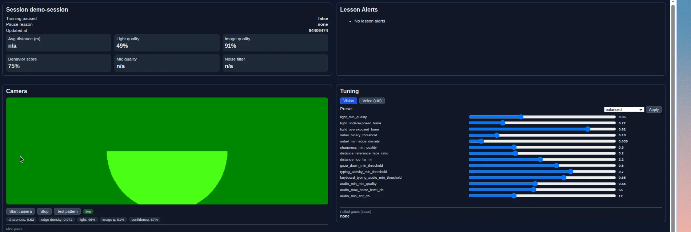
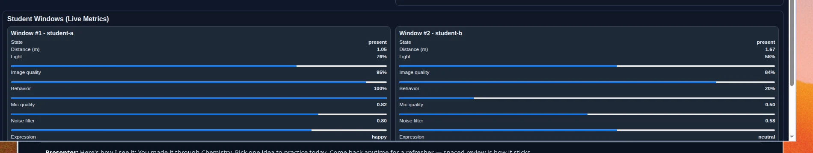

# Theodore Webcam Lab

A self-contained sandbox for Theodore's webcam recognition and voice agents:
presence and silhouette detection, expression and distraction signals, live
quality metrics, Sobel image analysis, tunable accuracy knobs, and a 26-language
voice agent.

Everything below runs offline. **No API key, no GPU and no webcam are required** —
the lab ships a frame seeder and a synthetic camera source, and the voice agent
falls back to a local responder when `XAI_API_KEY` is unset.

> Something not working? Jump to **[Step 5: check every part](#step-5-check-every-part)** —
> one command tells you exactly which piece is broken and how to fix it.

---

## Step 1 — Install what it needs

From the **repo root**, use the project venv (recommended):

```bash
source .venv/bin/activate
```

Or install into whatever `python3` you use:

```bash
python3 -m pip install "fastapi>=0.111,<0.116" "pydantic>=2.7,<3" \
    "uvicorn[standard]>=0.30,<0.35" "pytest>=8.2,<9" "httpx>=0.27,<0.28"
```

**Check it worked**

```bash
python3 -m pytest subrepos/theodore_webcam_lab/tests -q
```

You should see `114 passed`. If you see `ModuleNotFoundError`, the install above
did not run in the Python you are using. On macOS, bare `python3` is often
Homebrew 3.14 with no packages — activate `.venv` first (selfcheck does this
automatically when the venv exists).

---

## Step 2 — Start it

```bash
python3 -m uvicorn theodore_webcam_lab.main:app \
    --app-dir subrepos/theodore_webcam_lab/src --port 8015
```

Leave that running. **Check it worked**, from another terminal:

```bash
curl -s http://127.0.0.1:8015/health
# {"service":"theodore-webcam-lab","status":"ok"}
```

Port already taken? Use `--port 8016` and swap the port in the commands below.

---

## Step 3 — Give it something to look at

```bash
python3 subrepos/theodore_webcam_lab/scripts/seed_demo_session.py
```

This posts 60 frames for two simulated students: one healthy learner (whose
microphone drops out periodically, so you can see how missing data is handled)
and one distracted learner who trips the cheating signals.

Add `--rolling` to keep feeding a frame a second so the dashboard animates, or
`--degraded` to simulate a dim, out-of-focus, noisy room.

---

## Step 4 — Open the dashboard

<http://127.0.0.1:8015/theodore/webcam/live-monitor/demo-session>



**Left — Camera.** Press **Start camera** for your real webcam, **Test
pattern** if this machine has no camera, or **Silhouette demo** to see the
person-outline overlay trip silhouette detection. Camera samples no longer
overwrite the group demo metrics. Use **Load solo demo** / **Load group demo** /
**Start live feed**
at the top of the page to populate and animate student windows without a second
terminal.

**Right — Tuning.** Every accuracy threshold is a slider. Drag one and the gates
respond within a second. The **Vision** tab holds lighting, sharpness, distance
and audio knobs; the **Voice (xAI)** tab holds the conversation knobs. The
preset dropdown applies a whole room profile at once (`low_light`,
`bright_room`, `noisy_room`, `high_accuracy`, `wide_angle_laptop`).

Scroll down for per-student detail:



**Try this:** drag `sharpness_min_quality` to the right and watch `image_blurry`
appear in Live gates; drag it back and it clears. That is the whole tuning loop.

---

## Step 5 — Check every part

When something does not work, run this instead of guessing:

```bash
python3 subrepos/theodore_webcam_lab/scripts/selfcheck.py
```

It walks the same path the product takes and prints one line per step:

```text
Theodore webcam lab — self check
============================================================

Offline (no server needed)
  [PASS] Python 3.11+
         running 3.12.3
  [PASS] Python dependencies
         fastapi, pydantic, uvicorn present
  [PASS] Lab package imports
  [PASS] Webcam analysis
         distance=1.0m confidence=0.85
  [PASS] Sobel imaging
         backend=numpy sharp=0.81 blurred=0.08
  [PASS] Tuning knobs
         45 vision knobs, 13 voice knobs, presets: balanced, bright_room, ...

API (http://127.0.0.1:8015)
  [PASS] API reachable
  [PASS] Frame evaluation
         confidence=0.87 gates=none
  [PASS] Live metrics
         series aligned with timestamps
  [PASS] Live monitor page
         camera panel and tuning sliders present
  [PASS] Tuning API
  [PASS] Voice agent
         provider=local-fallback (set XAI_API_KEY for real xAI replies)
  [PASS] Webcam games

============================================================
All 13 checks passed.
```

When a step fails it tells you what to do about it:

```text
  [FAIL] API reachable
         http://127.0.0.1:8015: [Errno 111] Connection refused
         fix: python3 -m uvicorn theodore_webcam_lab.main:app \
              --app-dir subrepos/theodore_webcam_lab/src --port 8015
```

Useful flags:

| Flag | Why |
| --- | --- |
| `--serve` | Starts the API itself, checks it, then shuts it down. One command, no setup. |
| `--base-url URL` | Point at a lab running elsewhere. |
| `--port N` | Port for `--serve`. |

It exits `0` when everything passes and `1` otherwise, so CI can gate on it.

---

## If it still does not work

| Symptom | Cause and fix |
| --- | --- |
| `ModuleNotFoundError: fastapi` | Step 1 installed into a different Python. Re-run it with the same `python3` you start the server with. |
| `Address already in use` | Something else holds the port. Use `--port 8016`, or find the owner with `lsof -ti :8015` and stop that specific process. |
| Dashboard says "No metrics yet" | Click **Load solo demo** or **Load group demo**, or run Step 3. Session id in the URL must match (`demo-session`). |
| Confused by 3 student windows | Group demo is synthetic (not 3 webcams). Use **Load solo demo (1 student)** or **Start camera**. |
| Charts are flat | Click **Start live feed**, or re-seed with `--rolling`. |
| Camera stays black, status "camera unavailable" | No camera, or permission denied. Use **Test pattern** or **Silhouette demo**. |
| Starting the camera wiped student windows | Fixed: camera posts with `persist_live_metrics=false`. Reload demo data if an older lab build already clobbered the session. |
| No cheating / silhouette | Click **Load group demo (3 students)**. student-b cheats; student-c is silhouette-only. |
| Lesson alerts do nothing | Click **Run lesson action** — it acknowledges the alert, toasts the action, and jumps to the student window. |
| Applying a tuning preset changes nothing | Load a demo (solo or group) first, stay on the **Vision** tab, then change a knob/preset. The lab re-scores open sessions immediately — watch **Failed gates (class)** and student distance/quality flags. Voice presets only affect Theodore replies. |
| Camera blocked on another machine | `getUserMedia` needs a secure context. `127.0.0.1` and `https` work; a plain `http://<lan-ip>` does not. |
| Voice replies say `local-fallback` | Expected without a key. Set `XAI_API_KEY` for real xAI replies. |
| Everything looks broken | Run Step 5. It isolates the failing piece. |

---

## What else is in here

| Path | What it is |
| --- | --- |
| `README.txt` | The full reference: every API endpoint, every tuning knob, the quality gates, and the detailed test procedure. |
| `VISION_TRAINING_OPERATIONS.txt` | The proprietary training programme and the 24/7 agent operations runbook. |
| `scripts/selfcheck.py` | The step-by-step health check from Step 5. |
| `scripts/seed_demo_session.py` | The demo frame seeder from Step 3. |
| `training/vision_training_runbook.json` | Job definitions for the continuous training loop. |
| `tests/` | Executable specifications. `test_audit_regressions.py` documents each fixed bug with a reproduction. |

### The endpoints, in short

```text
POST /api/theodore/webcam/evaluate                 analyse a batch of frames
POST /api/theodore/webcam/demo/seed                load healthy/cheating/silhouette demo
POST /api/theodore/webcam/demo/roll/start          animate demo metrics in-process
POST /api/theodore/webcam/demo/roll/stop           stop the in-process demo feed
POST /api/theodore/webcam/alerts/acknowledge       mark a lesson alert as handled
POST /api/theodore/webcam/alerts/action            execute the lesson alert action
GET  /api/theodore/webcam/live-metrics/{session}   chart-ready metric series
GET  /theodore/webcam/live-monitor/{session}       the dashboard above
GET  /api/theodore/vision/tuning                   read accuracy knobs
PATCH/api/theodore/vision/tuning                   change them live
POST /api/theodore/vision/tuning/preset/{name}     apply a room preset
GET  /api/theodore/vision/policy                   read timing/session policy knobs
PATCH/api/theodore/vision/policy                   change grace windows live
GET  /api/theodore/voice/tuning                    read xAI conversation knobs
PATCH/api/theodore/voice/tuning                    change voice knobs live
POST /api/theodore/voice/tuning/preset/{name}      apply a voice preset
POST /api/theodore/voice/respond                   talk to Theodore
POST /api/theodore/voice/ask-question              generate a practice question
POST /api/theodore/vision/imaging/analyze          Sobel + exposure report
POST /api/theodore/webcam/games/challenge          issue a reinforcement game
POST /api/theodore/webcam/games/attempt            score a game attempt
```

Full parameter detail for each is in `README.txt`.
